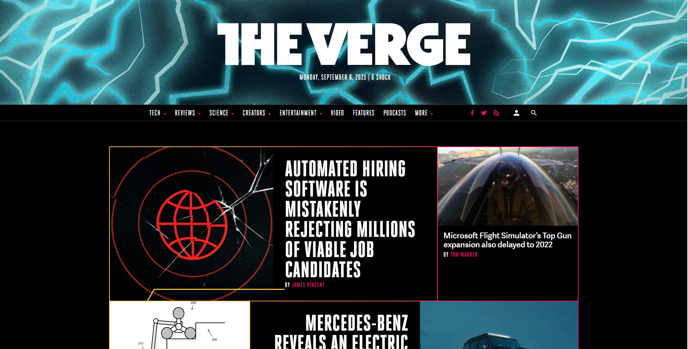
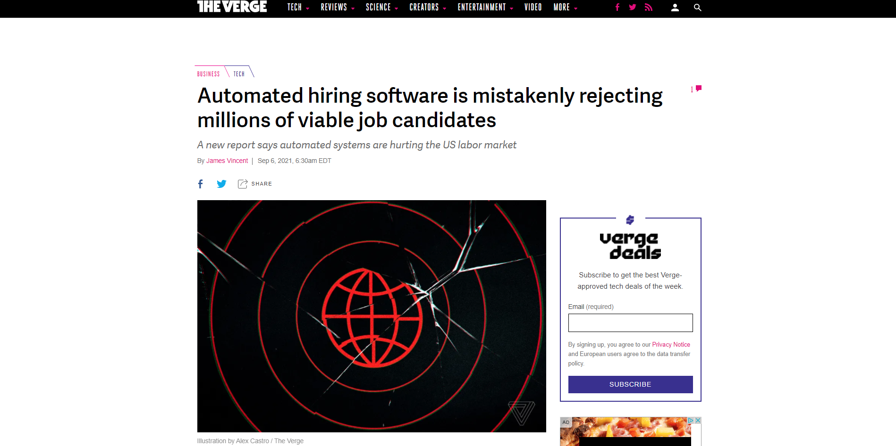

# Procesverslag v1

Markdown is een simpele manier om HTML te schrijven.  
Markdown cheat cheet: [Hulp bij het schrijven van Markdown](https://github.com/adam-p/markdown-here/wiki/Markdown-Cheatsheet).

Nb. De standaardstructuur en de spartaanse opmaak van de README.md zijn helemaal prima. Het gaat om de inhoud van je procesverslag. Besteedt de tijd voor pracht en praal aan je website.

Nb. Door *open* toe te voegen aan een *details* element kun je deze standaard open zetten. Fijn om dat steeds voor de relevante stuk(ken) te doen.

## Jij

### Auteur

Anthonie Meijers

#### Je startniveau

Blauw

#### Je focus

Surface Plane

## Je website

### Je opdracht

De nieuwssite [The Verge](https://theverge.com)

#### Screenshot(s) van de eerste pagina (small screen)

Homepage

#### Screenshot(s) van de tweede pagina (small screen)

Een nieuwsartikel  

## Breakdownschets (week 1)

uitwerken na afloop 2e werkgroep

### de hele pagina

### dynamisch deel (bijv menu)

## Voortgang 1 (week 2)

### Verslag van meeting

 Helaas kon ik bij deze meeting niet aanwezig zijn. Dit kwam doordat ik op dat moment aan het verhuizen was.

## Voortgang 2 (week 3)

### Stand van zaken

Het responsive maken van de website vind ik nog erg lastig. 

### Verslag van meeting

hier na afloop snel de uitkomsten van de meeting vastleggen

- Flexbox is over het algemeen handiger.
- Gebruik nth-of-type
- Gebruik display:none om menu's verborgen te houden

## Toegankelijkheidstest (week 4)

### Bevindingen

Lijst met  bevindingen die in de test naar voren kwamen:

#### Dropdown

Het Dropdown menu wordt niet voorgelezen door de screenreader.

Het kan worden opgelost met behulp van het ARIA-label

#### Links

De links worden door de screenreader voorgelezen als "link". 

Gebruik een ARIA-label om de links te laten "verdwijnen" voor de screenreader.

## Voortgang 3 (week 4)

uitwerken voor 3e voortgang

### Stand van zaken

Ik merk dat ik over het algemeen de motivatie verlies. Ik merk ook dat ik erg achterloop, zowel met de stof als met het bouwen van mijn website. 

### Verslag van meeting

Door dat ik zo erg achterloop, heb ik geen vorderingen gemaakt in mijn website. Het had geen nut om bij de meeting aanwezig te zijn. 

## Eindgesprek (week 5)

### Stand van zaken

Ik vond eigenlijk alles lastiger dan gedacht. Het werk had ik onderschat. Het is daarom ook niet af.
Kleine micro interacties heb ik daarom ook niet geïmplementeerd gekregen. Een tweede pagina is er ook niet van gekomen. 
### Screenshot(s)

## Herkansing (week 9/10)

### Stand van zaken

Ik vond eigenlijk alles lastiger dan gedacht. Het kostte mij best veel tijd. Het werk had ik opnieuw onderschat. Echter denk ik wel dat ik een goed resultaat heb afgeleverd.

De volgende micro-interacties zitten er in:
1. Video/geluid (met iFrame, omdat er op de video's copyright zit.)
2. Dark/Light mode
3. Animaties (in de knop voor dark/light-mode)
4. Advanced positioning (popup op de artikel pagina)
5. Formulieren (in popup)
6. Popup interactie

### Screenshot(s)

## Bronnenlijst

1. W3schools; <https://www.w3schools.com/css/css_dropdowns.asp>
2. <https://developer.mozilla.org/en-US/docs/Web/CSS/border-bottom>
3. <https://seekvectorlogo.com/the-verge-vector-logo-svg/>
4. <https://www.freecodecamp.org/news/use-svg-images-in-css-html/>
5. <https://stackoverflow.com/questions/24933430/img-src-svg-changing-the-styles-with-css>
6. <https://www.pngkit.com/bigpic/u2q8t4t4i1y3u2e6/>
7. <https://www.youtube.com/watch?v=lpf-5mG9CGg&ab_channel=AdamKhoury>
8. <https://www.geeksforgeeks.org/how-to-create-toggle-switch-by-using-html-and-css/>
9. <https://www.youtube.com/watch?v=U2k4DWKt_FE&ab_channel=OnlineTutorials>
10. <https://stackoverflow.com/questions/18012420/draw-diagonal-lines-in-div-background-with-css>

